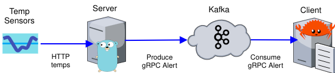
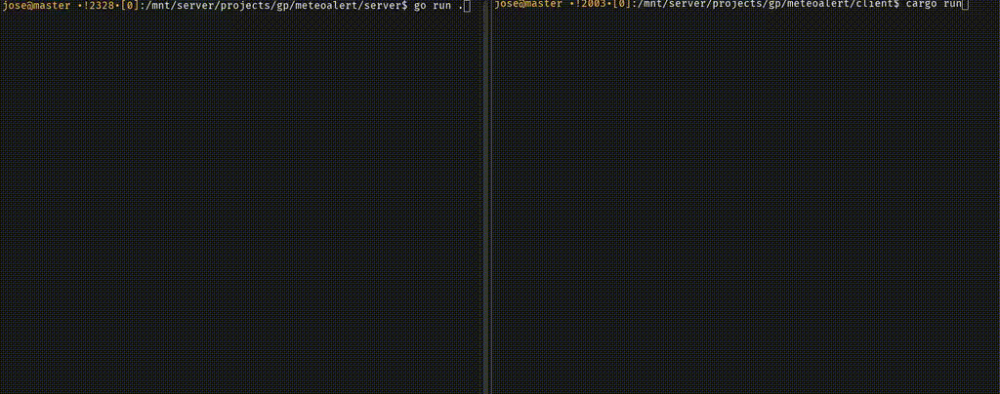

# TempAlert

## About the Project

This project demonstrates how to use `Kafka` as an event-driven middleware in an architecture based on events with `Go` and `Rust`.

- Use cases: Industrial monitoring, real-time alerts, and IoT systems.
- Technologies used: Kafka, gRPC, Docker, Go, and Rust.



## How It Works

TempAlert is a temperature monitoring system that uses Kafka as an event bus to communicate alerts between a server in Go and a client in Rust via gRPC.
This project simulates temperature sensors that send alerts when values are detected outside a safe range.

- `Go` Server responsible for monitoring temperatures from a simulated server.
- `Rust` Client that displays an alert when a temperature is out of the safe range.
- `Kafka` Stores server events and acts as an intermediary between the client and the server.

## Execution Example

- **Server (Go):** Every 3 seconds, it queries a remote service (`random.org`) to obtain simulated temperature values from industrial sensors.
- **Client (Rust):** The Rust consumer subscribes to the topic and displays alerts in the terminal when an event is received.
- **Infrastructure:** Kafka and Zookeeper run in Docker containers.



## Kafka

In this project, Kafka and Zookeeper run in Docker containers.

For testing environments, the option `KAFKA_AUTO_CREATE_TOPICS_ENABLE=true` is used to automatically create topics.

For production, it is better to define the topics explicitly with:

```bash
    -e KAFKA_CREATE_TOPICS="$TOPIC_NAME:$PARTITIONS:$REPLICAS"
```

```bash
# (...)
echo "Starting Zookeeper.."
docker run --name zookeeper -d --rm \
    --network "$NETWORK_NAME" \
    -p "$PORT_ZOOKEEPER:$PORT_ZOOKEEPER" \
    -e ZOOKEEPER_CLIENT_PORT="$PORT_ZOOKEEPER" \
    docker.io/confluentinc/cp-zookeeper:latest
# (...)
echo "Starting Kafka in PLAINTEXT..."
docker run --name kafka -d --rm \
    --network "$NETWORK_NAME" \
    -p "$PORT_KAFKA:$PORT_KAFKA" \
    -e KAFKA_BROKER_ID=1 \
    -e KAFKA_OFFSETS_TOPIC_REPLICATION_FACTOR=1 \
    -e KAFKA_ZOOKEEPER_CONNECT=zookeeper:"$PORT_ZOOKEEPER" \
    -e KAFKA_ADVERTISED_LISTENERS="$LISTENER" \
    -e KAFKA_AUTO_CREATE_TOPICS_ENABLE=true \
    docker.io/confluentinc/cp-kafka:latest
```

## Server (Golang)

### Kafka Producer

Creates a Kafka producer

```go
// (...)
	producer, err = kafka.NewProducer(&kafka.ConfigMap{"bootstrap.servers": "localhost:9092"})
	if err != nil {
		fmt.Printf("Error initializing Kafka Producer: %v\n", err)
		return
	}
// (...)
```

### Configuration

Loads configuration from a file (comments are self-explanatory)

```ini
# How many sensors to monitor?
sensors=5
# The min,max temperatures that sensors can measure
temp range=100,400
# min,max safe temperature range
safe range=125,350
```

### Load Sensor Temperatures

This is just an HTTP request to `random.org` that returns random numbers within a given range, simulating readings from hypothetical industrial furnace sensors.

```go
	url := fmt.Sprintf(
		"https://www.random.org/integers/?num=%d&min=%d&max=%d&col=1&base=10&format=plain&rnd=new",
		si.SensorsCount, si.MinReadableTemp, si.MaxReadableTemp)
    resp, err := http.Get(url)
    //(...)
```

### Proto & gRPC

In the proto file, only a structure is used as a message to send the sensor ID, its temperature, and the current date/time.

```proto
// (...)
message SensorAlert {
    int32 sensor_id = 1;
    int32 temperature = 2;
    string timestamp = 3;
```

## Client (Rust)

### Kafka Consumer

Creates a Kafka Consumer.

```rust
    let consumer: StreamConsumer = match ClientConfig::new()
        .set("bootstrap.servers", "localhost:9092")
        .set("group.id", "consumer_group")
        .set("auto.offset.reset", "earliest")
        .create()
    {
        Ok(c) => c,
        Err(e) => {
            eprintln!("Unable to create Kafka consumer: {}",e);
            process::exit(1)
        }
    };
```

### Proto & gRPC

- Uses the same `.proto` file as the server to ensure compatibility.
- Subscribes to the Kafka topic and consumes events in an asynchronous loop.
- Messages are deserialized using `prost` and displayed in a more readable format.

## Installation, Execution and Test

From the project's root directory.

### 1. Start Kafka and Zookeeper

Linux:

```bash
$ kafka/start-kafka.sh
```

Windows:

```bash
$ kafka/start-kafka.bat
```

### 2. Run the Server (Go)

```bash
$ cd server && go run .
```

### 3. Run the Client (Rust)

```bash
$ cd client && cargo run


```

## Some Test
Server 
- `Unit Test`: Verifies whether a temperature value is within the safe range.
- `Integration Test`: Produces a Kafka message and ensures it is sent correctly.
```bash
go test -v
```

Client
- `Unit Test`: Deserializes a message to verify data integrity.
```bash
cargo test
```